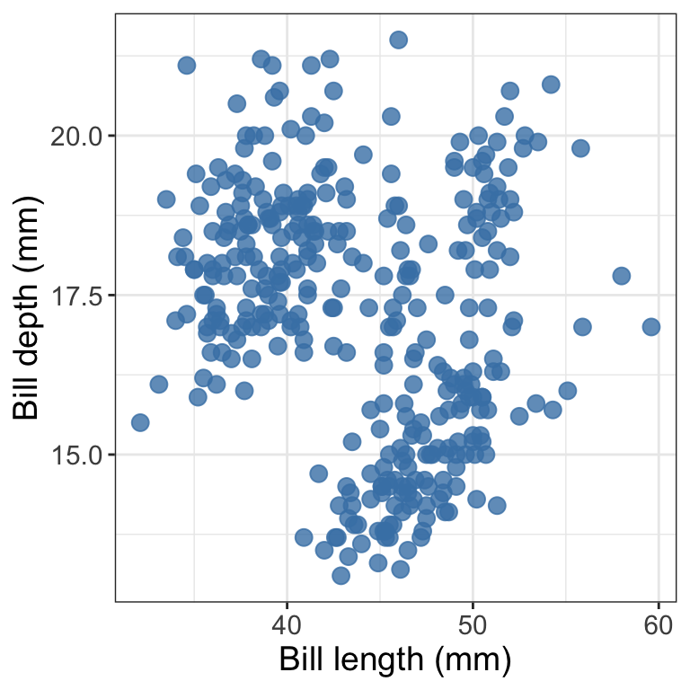
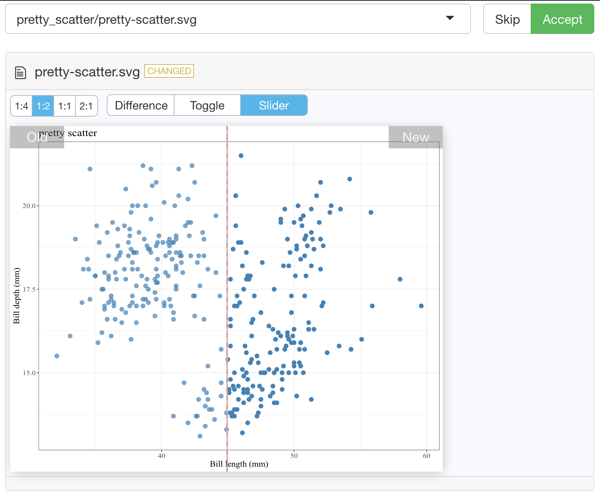

## `vdiffr` demo

<!-- README.md is generated from README.Rmd. Please edit that file -->

This is a demonstration of how to use the
[`vdiffr`](https://vdiffr.r-lib.org/index.html) package for visual
regression testing in R.

Say you have a function that creates a nicely formatted scatter plot
using `ggplot2`, such as the one shown below:

``` r
pretty_scatter <- function(.data, x_axis_col, y_axis_col) {
    ggplot2::ggplot(data = .data, 
                    ggplot2::aes(x = {{ x_axis_col }}, y = {{ y_axis_col }})) +
        ggplot2::geom_point(alpha = 0.8, colour = "steelblue", size = 3) +
        ggplot2::theme_bw() +
        ggplot2::theme(text = ggplot2::element_text(size = 14))
}

library(palmerpenguins)
library(ggplot2)
penguins_scatter <- pretty_scatter(penguins, bill_length_mm, bill_depth_mm) + 
    labs(x = "Bill length (mm)", y = "Bill depth (mm)")
penguins_scatter
#> Warning: Removed 2 rows containing missing values (geom_point).
```



And you want to write tests to make sure that as you further develop and
refactor your code, you do not break it. You can use the `vdiffr` visual
regression testing package to do this. First, you need to abstract the
function to an R script that lives in `R`. For this demo, we created a
file called `R/pretty_scatter.R` that houses the `pretty_scatter`
function shown above.

Then you need to setup a `tests` directory and test file in which to
house your tests that works with the
[`testthat`](https://testthat.r-lib.org/) framework (we recommend using
`usethis::use_testthat()` and `usethis::use_test("FUNCTION_NAME")` to do
this).

Finally, add an expectation with `vdiffr::expect_doppelganger` to your
`test_that` statement:

``` r
library(palmerpenguins)
library(ggplot2)
library(vdiffr)
source("../../R/pretty_scatter.R")

penguins_scatter <- pretty_scatter(penguins, bill_length_mm, bill_depth_mm) + 
    labs(x = "Bill length (mm)", y = "Bill depth (mm)")
penguins_scatter

test_that("refactoring our code should not change our plot", {
    expect_doppelganger("pretty scatter", penguins_scatter)
})
```

Then when you run `testthat::test_dir("tests/testthat")` to run your
test suite for the first time, it will take a snapshot of the figure
created in your test for that visualization and save it to
`tests/testthat/_snaps/EXPECT_DOPPELGANGER_TITLE.svg`. Then as you
refactor your code, you and run `testthat::test_dir("tests/testthat")`
it will compare a new snapshot of the figure with the existing one. If
they differ, the tests will fail. You can then run
`testthat::snapshot_review()` to get an interactive viewer which will
let you compare the two data visualizations and allow you to either
choose to accept the new snapshot (if you wish to include the changes to
the data visualization as part of your code revision and refactoring) or
you can stop the app and revert/fix some of your code changes so that
the data visualization is not unintentionally changed.

Below we show an example of running `testthat::snapshot_review()` after
we made our tests fail by removing `alpha = 0.8` from our
`pretty_scatter` function source:

``` r

```


